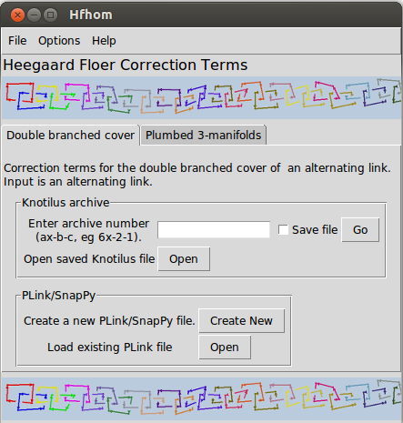

hfhom/corrterms
=====
<!---
Install pandoc (http://johnmacfarlane.net/pandoc/)
Convert to html by cd'ing into the directory with the README file, then using
$ pandoc -f markdown -t html README.md -o README.html
-->
A package to compute the Heergaard Floer correction terms for some classes of 
3-manifolds. Information and examples concerning the correction terms may be
found in a paper by P. Ozsvath, Z. Szabo,
[On the Heegaard Floer homology of branched double-covers](http://www.sciencedirect.com/science/article/pii/S0001870804001690).

Specifically, the package computes the correction terms for the following:

* Double branched cover of an alternating link (input is an alternating link)
    + Input type 1: [Knotilus database](http://knotilus.math.uwo.ca/)
    + Input type 2: [Plink drawing](http://www.math.uic.edu/t3m/SnapPy/plink.html)

* Plumbed 3-manifold constructed from a negative-definite weighted graph with
  with at most two bad vertices
    + Input type 1: Seifert fibered rational homology sphere data 
      {e; (p1, q1),...,(pr, qr)}
    + Input type 2: Negative-definite graph with an most two bad vertices

This program was written for a 
[Caltech SURF project](http://www.surf.caltech.edu/)
summer 2013 with mentor [Dr. Yi Ni](http://www.its.caltech.edu/~yini/).
Funding was also provided by Richter Memorial Funds.

Installation
------------
Installation the easy way requires `pip` first, with instructions 
[here](http://www.pip-installer.org/en/latest/installing.html). If you do not
have an installation of `plink` installed that python can find, run

`pip install -f http://math.uic.edu/t3m/plink plink`

before trying to install `hfhom`. The program source code is available on
[GitHub](https://github.com/). To install this program, find the repository
[https://github.com/th0114nd/hfhom](https://github.com/th0114nd/hfhom) or 
[https://github.com/panaviatornado/hfhom](https://github.com/panaviatornado/hfhom)
that is most up to date, then run either

`[sudo] pip install git+git://github.com/th0114nd/hfhom.git`

or

`[sudo] pip install git+git://github.com/panaviatornado/hfhom.git`

To test the installation, run

`hfhom`

For a successful installation, the program should start running.

If for some reason you cannot install it properly, you can download all the
files in the directory `corrterm` and run `gui.py` with python. You will also
have to install the necessary python modules, if you do not have them installed
already.

To uninstall, run

`[sudo] pip uninstall hfhom`

Using the GUI
-----
It is recommended you run the GUI using a terminal or the command line, i.e.
calling `hfhom` from the terminal. This will provide information about the
program's current progress and intermediate results. On Linux, if the
computation is taking too long or using too many resources, you can cancel the
computation using Ctrl-C. You can also close the entire GUI if it is non-responsive via Ctrl-\ (Ctrl + backslash).

On the File menu, check the option for `Use multiprocessing` to use all the
threads on your computer instead of just one. This will speed up lengthy
computations and most likely max out your CPU usage (for knots/links with
enough crossings). This is only useful if your computer has multiple cores
or has multithreading enabled.

The GUI has two tabs, one for computing the corrections terms of the double
branched cover of an alternating link, and one for computing the correction
terms of a plumbed 3-manifold. Input for the double branched cover of an
alternating link is an alternating link from either 
[Knotilus](http://knotilus.math.uwo.ca/) or 
[Plink](http://www.math.uic.edu/t3m/SnapPy/plink.html).
Input for a plumbed 3-manifold is either Seifert data for a Seifert fibered
rational homology sphere or a negative definite weighted graph with at most
two bad vertices.

From the inputted data, a negative definite quadratic form is computed,
and then the Heegaard Floer correction terms are computed from the quadratic
form.

### Knotilus archive ###
The [Knotilus archive](http://knotilus.math.uwo.ca/) section has two input
methods, either by entering an archive number or opening a saved file download
from the Knotilus database.

* __Entering an archive number__  
Archive numbers must be of the form ax-b-c, for integers a, b, and c. 
For example, 6x-1-1 or 20x-5-10. This method requires an Internet connection,
and may take up to 20 seconds to load the link for 11 or more crossings.
Visiting the link's database page with your browser and letting it load first
will significantly decrease the program's running time. If the checkbutton
`Save file` is selected, the plaintext data from the Knotilus database is
saved in the current directory as `ax-b-c.txt`. Press the `Go` button
when finished entering the archive number.
See [here](http://knotilus.math.uwo.ca/doc/archive.html) for more details
about the Knotilus archive number.

* __Loading a downloaded Knotilus file__  
A valid Knotilus file is created by going to [Knotilus]
(http://knotilus.math.uwo.ca/), finding the desired link, then selecting
`Download > Plaintext` and saving the file. 
The program will run noticeably faster on a downloaded Knotilus file
than if it must fetch the file from the database. The option `original link`
will only work if the filename is of the form `ax-b-c.txt` or `ax-b-c`.
It will be ignored otherwise.

### PLink/SnapPy ###
The PLink/SnapPy section has two input methods, either by drawing a new link
using the PLink Editor or opening a saved PLink file. Instruction for using
PLink can be found in the documentation for SnapPy, 
[here](http://www.math.uic.edu/t3m/SnapPy/plink.html).

* __Drawing a new link__  
Clicking the `Create New` button will open the PLink editor. Draw the link 
in the editor. Ensure the link is alternating, or use the menu option 
`Tools > Make alternating`.
When finished drawing the link, close the window. A dialog to save the file
will appear. If you choose not to save the file, the program will not be able 
to check that your link is closed and alternating, and the option 
`original link` will be ignored. If the link is not closed and alternating, 
results will be unpredictable.

* __Loading a saved PLink file__  
A valid PLink file is created by drawing a link in the PLink editor, then using
the menu option `File > Save ...`.
Clicking the `Open` button will load the open file dialog to select a valid 
PLink file.

### Seifert data ###
Data for a Seifert fibered rational homology sphere is represented as a list
`[e,(p1,q1),...,(pr,qr)]`, where e and all the pi, qi are integers, and all
pi > 1 with gcd(pi, qi) = 1.
If the resulting quadratic form is not negative definite, an error message will
pop up.

### Weighted graph editor ###
This input method is for plumbed 3-manifolds constructed from a negative-
definite weighted graph with at most 2 bad vertices.

Opening the editor will produce a "Graph controls" dialog.

Note: Increasing the size of the pyplot window will space out nodes more,
which is useful in the case that they overlap.

* __Creating a node__  
A parent of -1 indicates that the node is a root node, i.e. has no parent.
To create a node, select its desired parent node, enter the node's weight
(integer), then click create. The graph will be draw using 
[matplotlib.pyplot](http://matplotlib.org/api/pyplot_api.html). Nodes are 
labeled `Nk,w`, where k is the node's number and w is its weight. For example,
if the first node had weight -3, it would be labeled `N0,-3`.
* __Editing a node__  
To edit a node, select the node's number. The node's parent and weight will be
edited at the same time. Enter the desired new data, then click `Done`. 
To leave the parent unchanged, select `same` from the dropdown menu.
To leave the weight unchanged, leave the entry field empty.
* __Deleting a node__
Only the last node (highest index) can be deleted.
* __Drawing/Saving/loading/exiting__  
    + The `Draw graph` button will open pyplot and draw the current graph. The
    + program will automatically do this each time a node is created, edited, 
      or deleted; this button is useful in case you close the pyplot window and
      don't want to create, edit, or delete a node or load a new graph.
    + Click the `Save` button to save the graph data in a plaintext file. The 
      file will contain the adjacency list of the graph, followed by a list of
      the node attributes.
    + Click the `Load` button to load graph data from a plaintext file. The 
      file must be in the same format used by `Save`. Loading a file will 
      remove the current graph shown in pyplot. After loading a file, nodes may
      be created or edited. Note: The program uses the `eval()` method to parse
      the node attribute data. Thus, don't put Python code there that will harm
      your computer. (The program will raise an error if the data isn't a list,
      so doing this accidentally would be practically impossible.)
    + Click the `Done/compute` button to close the editor and compute the 
      correction terms. 
    + Click the `Cancel` button to close the editor without computing 
      anything.
    + If attempting to compute the correction terms, an error message will pop
      up if the quadratic form is not negative definite.

### Options ###
Under the `Options` menu, there are three global options, `Print quadratic form`, `Print H_1(Y) type', and `Condense correction terms`. Additionally,
there are the submenus `Double branched cover` and `Plumbed 3-manifolds`,
which only affect those input methods, respectively. If an option starts with
"Print", it will print additional information in the correction terms window.
If an option starts with "Show", it will open a new window.

* __Global Options__  
If the `quadratic form` option is checked, the quadratic form
(square matrix) will be printed, in addition to the correction terms, in the
output window. Checking the `condense correction terms` box will disable the
`quadratic form`, `graph commands`, and `Seifert data` options, and the 
output window will just contain the Knotilus archive number or filename,
followed by a space and the correction terms, all on a single line. 
For the `quadratic form` option with Seifert data, if the manifold orientation
is reversed, the quadratic form will be for the altered (reversed) manifold,
rather than the original.
The option `Print H_1(Y) type' is checked by default; it prints the group
structure of the first homology group H_1(Y).

* __Double branched cover submenu__  
If the `Show original link` option is checked, a separate window will open to 
show the original link diagram. For Knotilus, this will open an Internet 
browser tab to the appropriate link. It may not work on Windows.
If opening a saved Knotilus file, this option will only succeed if the 
filename is of the form `ax-b-c.txt` or `ax-b-c`, 
where 'ax-b-c' is the archive number. For PLink or SnapPy, the PLink editor 
will open with the original link drawing. The PLink file must be saved in 
order to do this.

* __Plumbed 3-manifold submenu__  
If the `Show weighted graph` option is checked, the graph will be drawn in a
separate window using 
[matplotlib.pyplot](http://matplotlib.org/api/pyplot_api.html). The option 
`Print modified Seifert data` only affects Seifert data input.

Command line operations
-----
### graph_quad ###
This module handles double-branched covers and outputs the associated quadratic
form.

Usage:

`$ python graph_quad.py [-s] archive_num`

`$ python graph_quad.py -f archive_num.txt`

`$ python graph_quad.py -p [filename]`

The first two usages are for Knotilus. Use -s to save the plaintext file in the
current directory. Use -f to indicate loading the file 'archive_num.txt'. 
The printed time to 'anneal' has to do with how long the Knotilus server takes
to render the link and create the plaintext file.
The last usage is for PLink. Optional argument 'filename' indicates loading
'filename'. No optional argument starts the PLink editor.

### ndqf ###
The ndqf (negative definite quadratic form) module takes the negative definite
quadratic form (as a matrix) and computes the correction terms. It does NOT
check that the matrix you enter is negative definite. (The program itself
currently checks this in the modules that create the matrix instead.)

Usage:

    >>> x = NDQF([[-5, -2], [-2, -4]])
    >>> x.correction_terms()
    Computed from quadratic form in 0.04 seconds
    '7/16, 1/4, -9/16, 0, -1/16, -3/4, -1/16, 0, -9/16, 1/4, 7/16, 0, -17/16,
    -3/4, -17/16, 0'
    >>> x.group
    Structure decomposition: H_1(Y) ~ Z/16Z.
    Generating vectors in order of invariant factor:
    [[0 1]] has order 16.
    Relation vectors (congruent to 0):
    [[ 1 -6]]

### smith ###
The Smith module computes the Smith Normal Form of a numpy matrix, as well as 
the unimodular accompanying factors. The algorithm is an implementation of
that of [Havas and Majewski](http://itee.uq.edu.au/~havas/1997hm.pdf). 

Usage:

    >>> x = np.matrix([[-5, -2], [-2, -4]])
    >>> d, (u, v) = smith_normal_form(x)
    >>> assert u * d * v = x
    >>> print d
    [[1 0
      0 16]]

